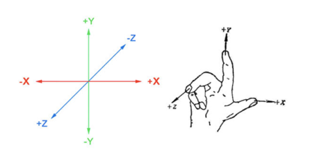
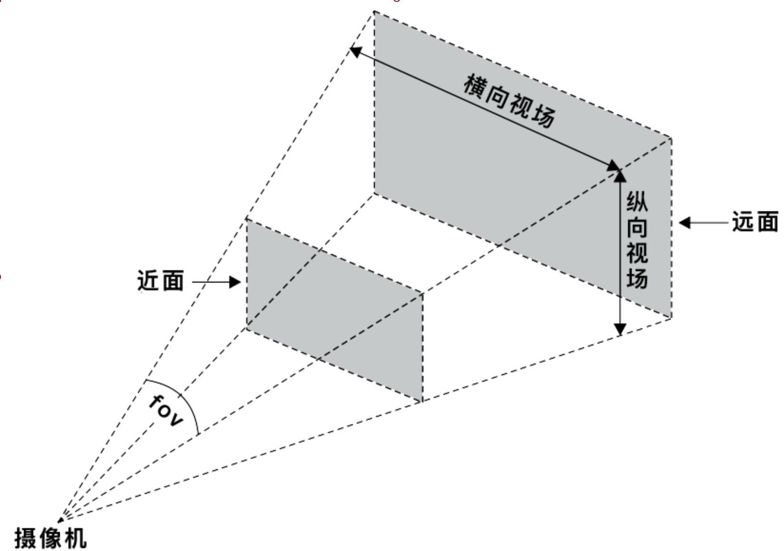
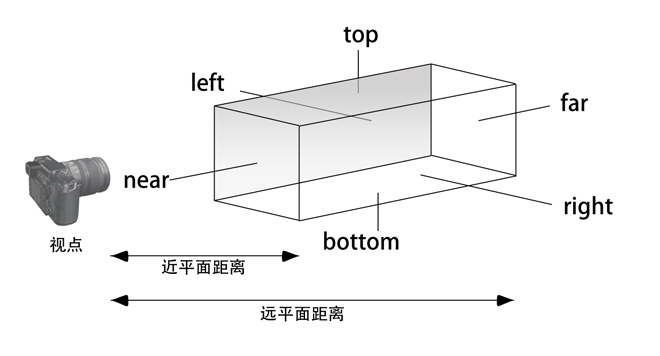

### Three.js基础知识

使用Three.js绘制一个三维效果，至少需要以下几个步骤：


- 创建一个容纳三维空间的场景 (***\*Sence\****)
- 将需要绘制的元素加入到场景中，对元素的形状、材料、阴影等进行设置
- 给定一个观察场景的位置，以及观察角度，我们用相机对象（***\*Camera\****）来控制
- 将绘制好的元素使用渲染器（***\*Renderer\****）进行渲染，最终呈现在浏览器上

拿电影来类比的话，场景对应于整个布景空间，相机是拍摄镜头，渲染器用来把拍摄好的场景转换成胶卷。

[THREE.js文档](https://threejs.org/docs/index.html#manual/zh/introduction/Creating-a-scene)

<!--more-->

#### 场景

场景允许你设置哪些对象被three.js渲染以及渲染在哪里。在场景中放置对象、灯光和相机。

很简单，直接创建一个Scene的实例即可。`_scene = new Scene()`

#### 元素（包含光线）

Three.js 为我们提供了非常多的Geometry，例如SphereGeometry（球体）、TetrahedronGeometry（四面体）、TorusGeometry（圆环体）等等。

在Three.js中，材质（Material）决定了几何图形具体是以什么形式展现的。它包括了一个几何体如何形状以外的其他属性，例如色彩、纹理、透明度等等，Material和Geometry是相辅相成的，必须结合使用。

#### 相机

##### 坐标系





我们可以在场景中添加一个坐标系，清楚的看到元素处于什么位置.

```js
//坐标系插件

scene.add(new THREE.AxisHelper(1000));//坐标系插件

scene.add(new THREE.AxisHelper(1000));
```

#####  PerspectiveCamera（透视相机）

```js
   _camera = new PerspectiveCamera(fov, aspect, near, far);
```


最常用的摄像机类型，模拟人眼的视觉，近大远小（透视），如果是需要模拟现实，基本都是用这个相机。Fov表示的是视角，Fov越大，表示眼睛睁得越大，离得越远，看得更多。aspect代表水平方向和竖直方向可观测距离的比值。near、far分别对应相机可观测的最近和最远距离。




##### **OrthographicCamera（正交投影相机）**

```js
_camera = new OrthographicCamera(left, right, top, bottom, near, far);
```


只有在这个矩形可视区域内才是可见的物体无论物体距离相机距离远或者近，在最终渲染的图片中物体的大小都保持不变。对于渲染2D场景或者UI元素是非常有用的。



##### **position、lookAt**

position属性指定了相机所处的位置。lookAt函数指定相机观察的方向。接收的参数都是一个类型为Vector3的对象。

#### **渲染器**

Three.js也为我们提供了几种不同的渲染器，主要看WebGL渲染器(WebGLRenderer)。WebGL渲染器使用WebGL来绘制场景，其够利用GPU硬件加速从而提高渲染性能。Three.js绘制的元素添加到浏览器上，这个过程需要一个载体，这个载体就是Canvas，你可以通过_renderer.domElement获取到这个Canvas，并将它给定到真实DOM中。

```js
_renderer = new WebGLRenderer();
_container = document.getElementById('conianer');
_container.appendChild(_renderer.domElement);
```

使用setSize函数设定你要渲染的范围，实际上它改变的就是上面Canvas的范围.通过render函数渲染上面指定的场景和相机.

```js
_renderer.setSize(window.innerWidth, window.innerHeight);
_renderer.render(_scene, _camera);
```

#### **requestAnimationFrame**

要渲染的元素可能并未被加载完，你就执行了渲染，并且只执行了一次，这时需要requestAnimationFrame方法，让场景和相机进行实时渲染。

```js
function animate() {
  requestAnimationFrame(animate);
  _renderer.render(_scene, _camera);
}
```

>- 参考：[VR全景功能](https://ouyangresume.github.io/2019/08/20/VR全景功能/)

