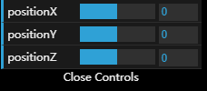
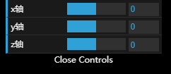

##  Scene 场景和页面调试

场景是我们每个 Three.js 项目里面放置内容的容器，我们也可以拥有多个场景进行切换展示，你可以在场景内放置你的模型、灯光和照相机。还可以通过调整场景的位置，让场景内的所有内容都一起跟着调整位置。


<!--more-->

### 场景的结构

之前在刚刚开始学 JavaScript 基础时，我们总免不了去操作 DOM 对象，而且我们都知道 DOM 的结构是树形结构的，Three.js 也遵循了这样的理念，将所有可以添加到场景内的结构梳理成了一种树形的结构，方便我们能够更好的理解Three.js。

我们可以把 Scene 想象成一个 body，body 内可以添加 DOM 对象，scene 内也可以添加它的 3D 对象，这样一层层的嵌套出来，组成了我们现在需要的项目。所以，在 Three.js 中，为了方便操作，将所有 3D 对象共同的内容抽象成了一个基类，就是 `THREE.Object3D`。

### THREE.Object3D

为了方便操作，Three.js 将每个能够直接添加到场景内的对象都继承自一个基类——`THREE.Object3D`，以后我们将继承自这个基类的对象称为 3D 对象，判断一个对象是否是继承自 `THREE.Object3D`，我们可以这么做：

```js
obj instanceof THREE.Object3D
//继承至返回 true 否则返回false
```

这个基类上封装了我们常用的一些方法，下面我们分别介绍下。

#### 添加一个 3D 对象

```js
scene.add(mesh); //将网格添加到场景
```

将一个立方体添加到场景内显示。

这个方法不光能够在场景内使用，而且也可以将一个 3D 对象添加到另一个 3D 对象里面，代码如下：

```js
parent.add(child);
```

#### 获取一个 3D 对象

获取一个 3D 对象可以使用 getObjectByName 通过 3D 对象的 name 值进行获取，在获取前我们首先要设置当前 3D 对象的 name 值：

```js
object3D.name = "firstObj";
scene.add(object3D);
scene.getObjectByName("firstObj"); //返回第一个匹配的3d对象
```

另一种方式就是使用 getObjectById 通过 3D 对象的 id 值进行获取，3D 对象的 id 值只能读取，它是在添加到场景时，按 1、2、3、4、5……的顺序默认生成的一个值，无法自定义：

```js
scene.getObjectById(1); //返回id值为1的3d对象
```

#### 删除一个 3D 对象

如果我们想隐藏一个 3D 对象，而不让它显示，可以通过设置它的 visible的值来实现：

```js
mesh.visible = false; //设置为false，模型将不会被渲染到场景内
```

如果一个模型不再被使用到，需要彻底删除，我们可以使用 remove 方法进行删除：

```js
scene.add(mesh); //将一个模型添加到场景当中
scene.remove(mesh); //将一个模型从场景中删除
```

#### 获取到所有的子类

每一个 3D 对象都有一个 children 属性，这是一个数组，里面包含所有添加的 3D 对象：

```js
scene.add(mesh1);
scene.add(mesh2);
console.log(scene.children);
// [mesh1, mesh2]
```

如果想获取 3D 对象下面所有的 3D 对象，我们可以通过 traverse方法获取：

```js
mesh1.add(mesh2); //mesh2是mesh1的子元素
scene.add(mesh1); //mesh1是场景对象的子元素
scene.traverse(fucntion(child){
    console.log(child);
});
//将按顺序分别将mesh1和mesh2打印出来
```

#### 获取 3D 对象的父元素

每个 3D 对象都有一个父元素，可以通过 parent 属性进行获取：

```js
scene.add(mesh); //将模型添加到场景
console.log(mesh.parent === scene); //true
```

#### 修改 3D 对象

前面介绍了场景的结构以及场景的 3D 对象添删查，下面，我们接着介绍对场景内模型的一些操作。

##### 修改位置方式

我们可以通过设置模型的 position 属性来修改模型的当前位置，具体方法有以下几种。

- 单独设置每个方向的属性。

```js
mesh.position.x = 3; //将模型的位置调整到x正轴距离原点为3的位置。
mesh.position.y += 5; //将模型的y轴位置以当前的位置向上移动5个单位。
mesh.position.z -= 6;
```

- 直接一次性设置所有方向的属性。

```js
mesh.position.set(3, 5, -6);  //直接将模型的位置设置在x轴为3，y轴为5，z轴为-6的位置
```

- Three.js 模型的位置属性是一个 `THREE.Vector3`（三维向量）的对象，我们可以直接重新赋值一个新的对象。

```js
mesh.position = new THREE.Vector3(3, 5, -6); //上面的设置位置也可以通过这样设置。
```

##### 修改大小的方式

模型导入后，很多情况下都需要调整模型的大小。我们可以通过设置模型的 scale 属性来调整大小。

- 第一种方式是单独设置每个方向的缩放。

```js
mesh.scale.x = 2; //模型沿x轴放大一倍
mesh.scale.y = 0.5; //模型沿y轴缩小一倍
mesh.scale.z = 1; //模型沿z轴保持不变
```

- 第二种是使用 set 方法。

```js
mesh.scale.set(2, 2, 2); //每个方向等比放大一倍
mesh.scale.set(0.5, 0.5, 0.5); //每个方向等比缩小一倍
```

- 第三种方式，由于 scale 属性也是一个三维向量，我们可以通过赋值的方式重新修改。

```js
mesh.scale = new THREE.Vector3(2, 2, 2); //每个方向都放大一倍
```

##### 修改模型的转向

很多情况下，我们需要对模型进行旋转，以达到将模型显示出它需要显示的方位，我们可以通过设置模型的 rotation 属性进行旋转（注意：旋转 Three.js 使用的是弧度不是角度）。

- 第一种方式是单独设置每个轴的旋转。

```js
mesh.rotation.x = Math.PI; //模型沿x旋转180度
mesh.rotation.y = Math.PI * 2; //模型沿y轴旋转360度，跟没旋转一样的效果。。。
mesh.rotation.z = - Math.PI / 2; //模型沿z轴逆时针旋转90度 
```

- 第二种方式就是使用 set 方法重新赋值。

```js
mesh.rotation.set(Math.PI, 0, - Math.PI / 2); //旋转效果和第一种显示的效果相同
```

正常模型的旋转方式是按照 XYZ 依次旋转的，如果你想先旋转其他轴，我们可以添加第四项修改，有可能的情况为：YZX、ZXY、XZY、YXZ 和 ZYX。

```js
mesh.rotation.set(Math.PI, 0, - Math.PI / 2, "YZX"); //先沿y轴旋转180度，再沿z轴旋转0度，最后沿x轴逆时针旋转90度
```

- 第三种方式，模型的 rotation 属性其实是一个欧拉角对象（`THREE.Euler`），欧拉角后面会讲解到，我们可以通过重新赋值一个欧拉角对象来实现旋转调整：

```js
mesh.rotation = new THREE.Euler(Math.PI, 0, - Math.PI / 2, "YZX"); 
```

### 使用 dat.GUI 实现页面调试

有些时候，我们需要调整模型的位置或者大小等，且需要每次都去场景内调试，一种常用的插件 `dat.GUI`

- 首先，需要将插件的源码引入到页面当中，我这里直接使用 CDN 的连接。

```js
<script src="https://cdn.bootcss.com/dat-gui/0.7.1/dat.gui.min.js"></script>
```

- 创建一个对象，在里面设置我们需要修改的一些数据。

```js
controls = {
    positionX:0,
    positionY:0,
    positionZ:0
};
```

- 实例化`dat.GUI`对象，将需要修改的配置添加对象中，并监听变化回调。

```js
gui = new dat.GUI();
gui.add(controls, "positionX", -1, 1).onChange(updatePosition);
gui.add(controls, "positionY", -1, 1).onChange(updatePosition);
gui.add(controls, "positionZ", -1, 1).onChange(updatePosition);

function updatePosition() {
    mesh.position.set(controls.positionX, controls.positionY, controls.positionZ);
}
```



这样，只要我们每次修改对象里面的值，都会触发 `updatePosition` 回调，来更新模型的位置。这样，我们就实现了一个简单的案例。

接下来，我列出一下经常会使用到一些方式和方法。

#### 生成一个输入框

`dat.GUI` 能够根据 controls 值的不同而生成不同的操作方法，如果值的类型为字符串或者数字类型，则可以生成一个默认的输入框：

```js
gui.add(controls, "positionX");
gui.add(controls, "positionY");
gui.add(controls, "positionZ");
```


#### 生成一个可以滑动的滑块

使用 `gui.add()` 方法，如果值为数字类型，传入的第三个值（最小值）和第四个值（最大值），就限制了值能够取值的范围，这样就生成了可以滑动的滑块：

```js
gui.add(controls, "positionX", -1, 1); //设置了最小值和最大值，可以生成滑块
gui.add(controls, "positionY").max(1); //只设置了最大值，无法生成滑块
gui.add(controls, "positionZ").min(-1); //只设置了最小值，也无法生成滑块
```


我们还可以通过 step() 方法来限制每次变化的最小值，也就是你增加或者减少，必须都是这个值的倍数：

```js
gui.add(controls, "positionX", -10, 10).step(1); //限制必须为整数
gui.add(controls, "positionY", -10, 10).step(0.1); //每次变化都是0.1的倍数
gui.add(controls, "positionZ", -10, 10).step(10); //每次变化都是10的倍数
```


#### 生成一个下拉框

只要按规则在 `gui.add()` 的第三个值传入一个对象或者数组，`dat.GUI` 就能够自动匹配生成一个下拉框：

```js
controls = {
    positionX:0,
    positionY:false,
    positionZ:"middle"
};

gui = new dat.GUI();
gui.add(controls, "positionX", {left:-10, middle:0, right:10}); //数字类型的下拉框
gui.add(controls, "positionY", [true, false]); //布尔值类型的下拉框
gui.add(controls, "positionZ", ["left", "middle", "right"]); //字符串类型的下拉框
```


#### 生成一个 Checkbox

只要 controls 的值是一个布尔类型，使用 `gui.add()` 方法就可以生成一个复选框：

```js
controls = {
    positionX:true,
    positionY:false,
    positionZ:false
};

gui = new dat.GUI();
gui.add(controls, "positionX");
gui.add(controls, "positionY");
gui.add(controls, "positionZ");
```


#### 生成一个点击事件按钮

如果 controls 的值为一个函数 Function，`dat.GUI` 会自动生成一个可以点击的按钮，当按下时就会触发这个函数事件：

```js
        controls = {
            positionX:function () {},
            positionY:function () {},
            positionZ:function () {}
        };

        gui = new dat.GUI();
        gui.add(controls, "positionX");
        gui.add(controls, "positionY");
        gui.add(controls, "positionZ");
```


#### 修改显示的名称

我们可以在后面使用 name() 事件设置显示的名称：

```js
gui.add(controls, "positionX", -1, 1).name("x轴");
gui.add(controls, "positionY", -1, 1).name("y轴");
gui.add(controls, "positionZ", -1, 1).name("z轴");
```



#### 颜色选择框

实现颜色选择框，首先需要一种正常格式的颜色值，比如 CSS 的颜色样式或者 RGB 格式，然后再使用 `gui.addColor()` 的方法添加：

```js
controls = {
    positionX:"#cccccc", //css样式
    positionY: [0, 255, 255], //RGB格式
    positionZ: [0, 255, 255, 0.6] //RGBA格式
};

gui = new dat.GUI();
gui.addColor(controls, "positionX").name("x轴");
gui.addColor(controls, "positionY").name("y轴");
gui.addColor(controls, "positionZ").name("z轴");
```


#### 监听事件回调

`dat.GUI` 给我们提供了监听事件回调的方法 onChange()，如果值变化就能够触发函数回调：

```js
gui.add(controls, "positionX", -1, 1).onChange(updatePosition);
gui.add(controls, "positionY", -1, 1).onChange(updatePosition);
gui.add(controls, "positionZ", -1, 1).onChange(updatePosition);

function updatePosition() {
    mesh.position.set(controls.positionX, controls.positionY, controls.positionZ);
}
```

#### 创建分组

我们可以使用 `gui.addFolder()` 方法来创建分组：

```js
gui = new dat.GUI();
var first = gui.addFolder("第一个分组"); //创建第一个分组
first.add(controls, "positionX", -1, 1).onChange(updatePosition);
first.open();

var two = gui.addFolder("第二个分组");
two.add(controls, "positionY", -1, 1).onChange(updatePosition);
two.add(controls, "positionZ", -1, 1).onChange(updatePosition);
```

